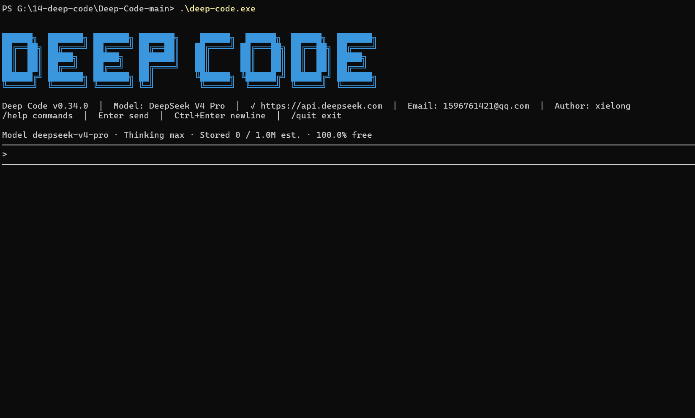

# Deep Code

> AI 驱动的 CLI 编程助手 — 对标 Claude Code，Go 语言打造，单文件分发，一行命令即装即用。

---

## 效果预览



---

## 一分钟安装

打开 **PowerShell**，输入：

```powershell
npm install -g deep-code-xl
```

安装完成后启动：

```powershell
deep-code
```

首次启动会自动引导你配置 API 地址和 Key，之后即可直接使用。

> **提示**：如果 `npm install` 速度较慢，可以先设置国内镜像：
> ```powershell
> npm config set registry https://registry.npmmirror.com
> ```

---

## 功能概览

| 类别 | 内容 |
|------|------|
| **内置工具** | Read / Write / Edit / Bash / Glob / Grep / Todo（9 个） |
| **内置命令** | 15 个公开命令 + 5 个隐藏命令，`/help` 查看全部 |
| **API 支持** | DeepSeek / OpenAI / Qwen / GLM / Kimi 多 Provider |
| **主题** | default、mono（更多主题开发中） |
| **自动更新** | 每次启动自动检查 GitHub 最新版本，强制更新，始终用最新版 |
| **平台** | Windows（PowerShell） |

---

## 基本使用

```powershell
# 启动
deep-code

# 进入交互模式后，直接描述需求
> 帮我搜索项目中所有 .go 文件中包含 "config" 的地方

# 修改文件
> 把 app/header.go 中的邮箱改成新的

# 运行命令
> 编译并运行测试
```

更多用法见 **[快速上手](快速上手.md)**。

---

## 第一次使用

1. 输入 `deep-code` 启动
2. 选择 API 提供商（DeepSeek / OpenAI / Qwen / GLM / Kimi / Custom）
3. 输入 API Key（隐藏回显，不外泄）
4. 完成，开始使用

配置会保存在本地 `config.json` 中，下次启动无需重新输入。

---

## 常见问题

遇到问题请先查看 **[常见问题](常见问题.md)**，大部分情况都有解答。

---

## 反馈与建议

如果遇到 Bug 或有改进建议，欢迎发送邮件到：

📧 **1596761421@qq.com**

为了让我更快定位问题，请尽量提供：

- **截图**（终端完整界面）
- **问题描述**（你在做什么操作、期望什么结果、实际发生了什么）
- **版本号**（启动 Deep Code 后第一行显示）
- **复现步骤**（越详细越好）

你的每一条反馈都会帮助 Deep Code 变得更好。

---

## 版本

当前版本：**v0.34.0**

更新历史见 **[更新日志](更新日志.md)**。

---

## 许可证

MIT License — 详见 [LICENSE](LICENSE)。

---

**作者**：xielong ｜ **仓库**：[github.com/Violet1314/deep-code-xl](https://github.com/Violet1314/deep-code-xl)
